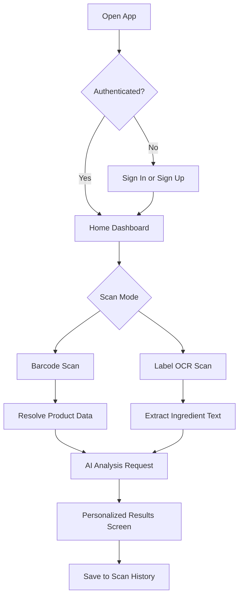

# Product Requirements Document

## Document Purpose
This PRD defines the product scope for Khasahi AI, a React Native application built for the OpenAI x NamasteDev Hackathon and designed to remain viable after the event as a consumer nutrition intelligence platform.

## Product Summary
Khasahi AI helps users understand packaged food and ingredients in real time. A user scans a barcode or product label, extracts product and ingredient information through OCR and barcode lookup workflows, and receives an AI-generated explanation tailored to dietary preferences, restrictions, and literacy level.

The product is intentionally opinionated around trust: every AI explanation must be grounded in structured product data, user preferences, and explainable rules rather than free-form speculation.

## Problem Statement
Consumers struggle to interpret ingredient labels quickly. Existing nutrition apps often fail in three ways:

| Problem | User Impact | Product Response |
| --- | --- | --- |
| Ingredient labels are dense and technical | Users abandon decisions or rely on guesswork | Translate ingredients into plain language |
| Dietary restrictions are personal and contextual | Generic health scores are not actionable | Personalize analysis by allergies, religion, and goals |
| Store aisle decisions are time-sensitive | Long workflows create drop-off | Deliver a scan-to-insight flow in under 10 seconds for common cases |

## Product Vision
Enable any shopper to make informed food decisions with the speed of a barcode scan and the clarity of a trusted nutrition coach.

## Business Goal
Use the hackathon build to demonstrate a credible path to a production consumer product with:

| Goal | Success Signal |
| --- | --- |
| Strong live demo | Stable end-to-end scan and explain workflow |
| Product-market story | Clear differentiation around personalization and explainability |
| Engineering credibility | Production-ready architecture, typed contracts, and measurable reliability |

## Target Users

| Segment | Core Need | Why They Will Use Khasahi AI |
| --- | --- | --- |
| Health-conscious shoppers | Quick understanding of ingredients and tradeoffs | Faster than manual label reading |
| Users with allergies or intolerances | Avoid unsafe ingredients | Personalized warnings with explicit rationale |
| Religious or ethical eaters | Understand whether products align with values | Ingredients mapped to dietary rules |
| Parents buying for families | Simplify ingredient complexity | Plain-language summaries and risk flags |

## User Value Proposition
Khasahi AI turns difficult labels into fast, personalized, evidence-based food guidance.

## Product Scope

### In Scope for V1

| Capability | Description | Priority |
| --- | --- | --- |
| Authenticated profiles | Supabase Auth for login and profile persistence | P0 |
| Barcode scan | Vision Camera barcode scanning for packaged items | P0 |
| OCR label scan | Google ML Kit for ingredient extraction from images | P0 |
| AI ingredient explanation | OpenAI Responses API generates structured analysis | P0 |
| Personalization | Preferences for allergies, diet type, exclusions, and goals | P0 |
| Scan history | Persist prior scans for recall and comparison | P1 |
| Product detail screen | Structured summary, warnings, and AI explanation | P1 |
| Offline-safe UI states | Graceful errors, retries, and cached recent history | P1 |

### Out of Scope for Hackathon Release

| Capability | Reason Deferred |
| --- | --- |
| Social sharing and community reviews | Not essential to validating the core loop |
| Wearables or health app integrations | High integration cost with limited demo value |
| Full e-commerce integrations | Requires broader catalog and partnership work |
| Multi-language localization | Valuable, but secondary to core intelligence quality |

## Functional Requirements

| ID | Requirement | Acceptance Criteria |
| --- | --- | --- |
| FR-01 | User can sign up, sign in, and restore session | Auth persists across app restarts |
| FR-02 | User can scan a barcode | App reads code and resolves a product request path |
| FR-03 | User can scan ingredient text | OCR extracts usable text from the image |
| FR-04 | System produces an ingredient analysis | Response includes summary, risks, and personalized notes |
| FR-05 | User can define dietary profile | Preferences affect analysis output deterministically |
| FR-06 | User can view prior scans | History lists prior products and outcomes |
| FR-07 | App handles uncertain data transparently | UI shows confidence or missing-data notices |

## Non-Functional Requirements

| Category | Requirement | Target |
| --- | --- | --- |
| Performance | Common scan-to-summary time | Under 10 seconds on stable network |
| Reliability | Crash-free demo session | Greater than 99% during judged demo path |
| Security | User data protection | Supabase row-level security and secure token storage |
| Maintainability | Feature isolation | Feature-first modules with typed boundaries |
| Observability | Trace key funnel events | Capture scan start, scan success, OCR quality, AI completion |

## Core User Journey

## Assumptions

| Assumption | Impact | Mitigation |
| --- | --- | --- |
| Barcode coverage will be incomplete for some products | Some scans must fall back to OCR or manual confirmation | Build graceful fallback UX |
| OCR quality varies by lighting and packaging | Ingredient extraction may be noisy | Add review step and confidence-aware prompts |
| AI output must be explainable for user trust | Generic summaries are insufficient | Require structured responses and rationale sections |

## Success Metrics

| Metric | Definition | Target for Demo Readiness |
| --- | --- | --- |
| Scan completion rate | Percentage of initiated scans reaching results | Greater than 85% |
| Median time to insight | Start scan to results rendered | Under 10 seconds |
| Personalization utilization | Percentage of users who set dietary preferences | Greater than 60% in test cohort |
| User trust signal | Test users say output is clear and useful | Greater than 4/5 average |

## Risks

| Risk | Severity | Response |
| --- | --- | --- |
| OCR noise creates wrong ingredient interpretation | High | Use extraction review and conservative AI wording |
| AI hallucinates unsupported claims | High | Constrain prompts to supplied evidence and rules |
| Camera permission friction reduces onboarding | Medium | Explain value before permission request |
| Product data inconsistencies across sources | Medium | Normalize server-side and mark unknowns explicitly |

## Release Recommendation
The V1 demo should optimize for one excellent story: "scan, understand, decide." Feature breadth must never compromise clarity, speed, or trust.
