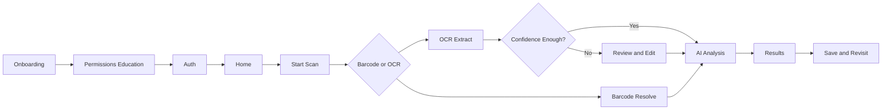

# UX Blueprint

## Experience Principles

| Principle | Meaning in Product Terms | UX Implication |
| --- | --- | --- |
| Speed over ceremony | The app is often used in a store aisle | Minimize taps between launch and insight |
| Trust through transparency | Nutrition advice is sensitive | Show data sources, confidence, and caveats |
| Personalization without clutter | User context matters, but UI must remain simple | Apply preferences automatically, reveal detail progressively |
| Calm guidance | Users may be anxious about ingredients | Use reassuring, plain-language copy and clear status states |

## Primary Screens

| Screen | Purpose | Key Elements |
| --- | --- | --- |
| Onboarding | Collect value context and permissions | Benefit framing, dietary setup, permission education. Figma reference: see [Design-System.md](../02-design/Design-System.md#design-references) |
| Auth | Create and restore user identity | Email or phone auth, session recovery |
| Home | Launch point for scans and history | Scan CTA, recent scans, profile shortcuts |
| Scanner | Barcode and OCR capture workflows | Camera frame, mode switcher, feedback states |
| Review | Confirm extracted text when OCR quality is imperfect | Editable ingredient text, retry action |
| Results | Deliver product understanding | Summary, risk chips, ingredient breakdown, personalization notes |
| History | Retrieve prior decisions | Timeline list, filters, search |
| Profile | Manage dietary rules and preferences | Allergies, exclusions, goals, notification settings |

## Information Hierarchy for Results
The results screen should answer the most urgent question first, then provide supporting evidence.

| Priority | Content | Why It Matters |
| --- | --- | --- |
| 1 | Overall recommendation summary | Supports fast decision-making |
| 2 | Personalized warnings | Prevents harmful or undesired purchases |
| 3 | Ingredient interpretation | Explains technical terms in plain language |
| 4 | Confidence and caveats | Maintains trust when data quality is imperfect |
| 5 | Full details and history actions | Supports deeper review and persistence |

## UX Flow Blueprint

## Interaction Model

| Interaction | Rule | Rationale |
| --- | --- | --- |
| Primary CTA placement | Fixed at bottom where appropriate | Thumb reach and consistency |
| Camera feedback | Immediate visual confirmation on scan | Reduces uncertainty |
| Loading states | Step-specific messaging rather than generic spinner | Makes waiting understandable |
| Errors | Provide a recovery path on every failure state | Preserves momentum |

## State Design

| State Type | Expected UX Treatment |
| --- | --- |
| Empty state | Explain value and offer immediate next action |
| Loading state | Show current stage such as scanning, extracting, analyzing |
| Partial data state | Present what is known, flag unknowns clearly |
| Error state | Explain issue plainly and offer retry or alternate path |
| Success state | Emphasize decision-ready takeaway first |

## Accessibility Blueprint

| Area | Requirement | Design Decision |
| --- | --- | --- |
| Text readability | High contrast and scalable type | Avoid dense paragraphs on mobile |
| Motion | Respect reduced motion settings | Keep animations informative, not essential |
| Voice and comprehension | Plain language for ingredient explanations | Favor short sentences and common terminology |
| Touch targets | Comfortable tap zones | Minimum 44x44 dp target areas |

## Personalization UX

| User Preference | UI Behavior |
| --- | --- |
| Allergies | Highlight red warnings and unsafe ingredient rationale |
| Vegetarian or vegan preference | Show compliance status and non-compliant ingredients |
| Religious preference | Surface culturally relevant ingredient concerns |
| Fitness goal | Adjust summary emphasis toward protein, sugar, additives, or processing |

## Assumptions

| Assumption | Design Effect |
| --- | --- |
| Users will often use the app one-handed | Large bottom-aligned actions and reduced text entry |
| Many scans occur under imperfect lighting | Strong scanner overlays and explicit rescan guidance |
| Users may not trust AI by default | Results must cite ingredient evidence and uncertainty |

## Decision Notes
The UX intentionally avoids a dashboard-heavy experience. The product value is immediate utility, so the interface should always pull the user toward scanning and understanding rather than browsing charts.
