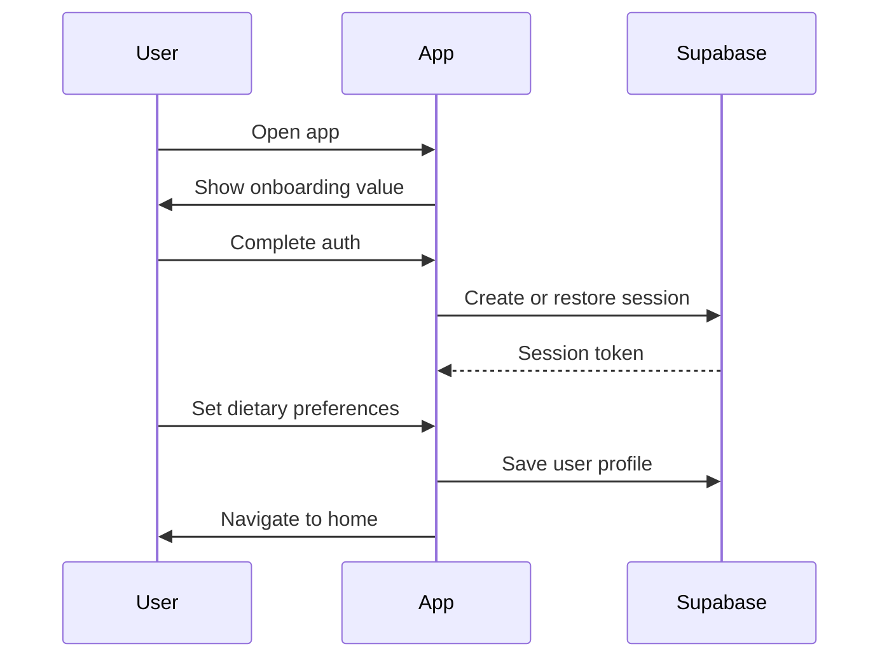
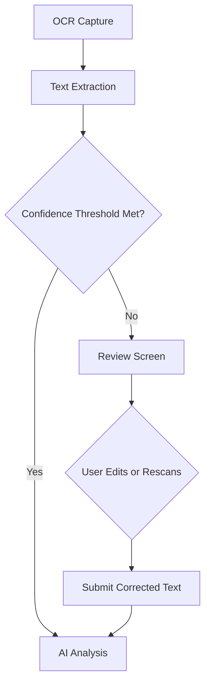

# User Flows

## Flow Inventory

| Flow ID | Flow Name | Goal |
| --- | --- | --- |
| UF-01 | New user onboarding | Activate a first-time user with profile context |
| UF-02 | Returning user quick scan | Reach results with minimal friction |
| UF-03 | OCR correction | Recover from imperfect ingredient extraction |
| UF-04 | Personalized result review | Help user understand relevance of output |
| UF-05 | History revisit | Reuse prior knowledge and reduce repeat effort |

## UF-01 New User Onboarding

| Step | User Action | System Response |
| --- | --- | --- |
| 1 | Open app | Show value proposition and setup entry |
| 2 | Continue onboarding | Explain permissions and personalization benefits |
| 3 | Sign in or sign up | Create Supabase Auth identity |
| 4 | Set dietary profile | Persist profile in PostgreSQL |
| 5 | Grant camera access | Enable scanner workflows |
| 6 | Land on home screen | Highlight scan CTA |

## UF-02 Returning User Quick Scan

| Step | User Action | System Response |
| --- | --- | --- |
| 1 | Tap scan | Open scanner with last-used mode |
| 2 | Scan barcode | Attempt product resolution |
| 3 | Wait for processing | Show progress by stage |
| 4 | View result | Display summary and warnings |
| 5 | Save automatically | Store scan event in history |

## UF-03 OCR Correction Flow

| Trigger | User Need | UX Response |
| --- | --- | --- |
| OCR confidence low | Ensure correctness before analysis | Open editable review screen |
| Text incomplete | Add missing terms manually | Support edit, retry, and rescan |
| Packaging glare | Recover failed extraction | Offer re-capture tips and alternate mode |

## UF-04 Personalized Result Review

| Step | User Question | UI Answer |
| --- | --- | --- |
| 1 | Is this safe for me? | Top summary and warning banner |
| 2 | Why is it flagged? | Ingredient-specific rationale |
| 3 | What should I watch out for? | Risk chips and detail cards |
| 4 | How certain is this? | Confidence and caveat section |

## UF-05 History Revisit

| Step | User Action | System Behavior |
| --- | --- | --- |
| 1 | Open history | Fetch recent scans from local cache then remote source |
| 2 | Select prior item | Open stored result snapshot |
| 3 | Compare or rescan | Allow user to initiate fresh analysis if desired |

## Edge Cases

| Scenario | Expected Product Behavior |
| --- | --- |
| Barcode not found | Fall back to OCR path with helpful explanation |
| No network during analysis | Show cached history and allow retry later |
| AI response delayed | Keep stage-aware progress state and timeout messaging |
| Profile incomplete | Use generic analysis and prompt user to improve personalization |

## Flow Decisions
User flows are intentionally designed to degrade gracefully. The strongest product promise is not that every scan succeeds perfectly, but that every failure offers a clear next step.
