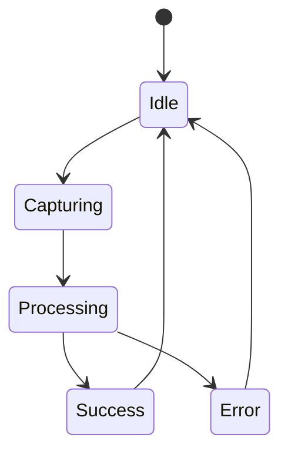

# Animations

## Motion Principles

| Principle | Interpretation |
| --- | --- |
| Functional | Motion explains state changes and progress |
| Light | Motion should never slow urgent user tasks |
| Respectful | Reduced motion settings must be honored |
| Consistent | Shared timing and easing patterns build polish |

## Animation Inventory

| Interaction | Animation | Purpose |
| --- | --- | --- |
| Screen entry | Subtle fade and rise | Improve perceived smoothness |
| Scan success | Fast highlight pulse | Confirm successful capture |
| Loading stages | Progress transition between states | Communicate system activity |
| Result reveal | Staggered card entrance | Guide reading order |
| Error appearance | Gentle shake or banner slide | Draw attention to recoverable issues |

## Timing Recommendations

| Motion Type | Duration Guidance |
| --- | --- |
| Tap feedback | 100-150 ms |
| Standard transitions | 180-250 ms |
| Result content reveal | 220-320 ms |
| Emphasis states | Under 400 ms |

## Motion Architecture

| Layer | Tooling Choice | Reason |
| --- | --- | --- |
| Gesture-driven interactions | React Native Gesture Handler plus Reanimated | High performance and native feel |
| Screen transitions | React Navigation transitions | Consistent navigation behavior |
| Micro-interactions | Reanimated shared values | Smooth UI-thread execution |

## Animation State Flow

## Accessibility and Performance

| Concern | Decision |
| --- | --- |
| Reduced motion | Replace transform-heavy animations with fades or instant states |
| Low-end devices | Prefer UI-thread animations and avoid layout thrashing |
| Information density | Use motion to stage content, not decorate it |

## Decision Notes
Animation in Khasahi AI should reinforce confidence. The best motion is subtle enough to feel polished while still making each processing step legible to the user.
