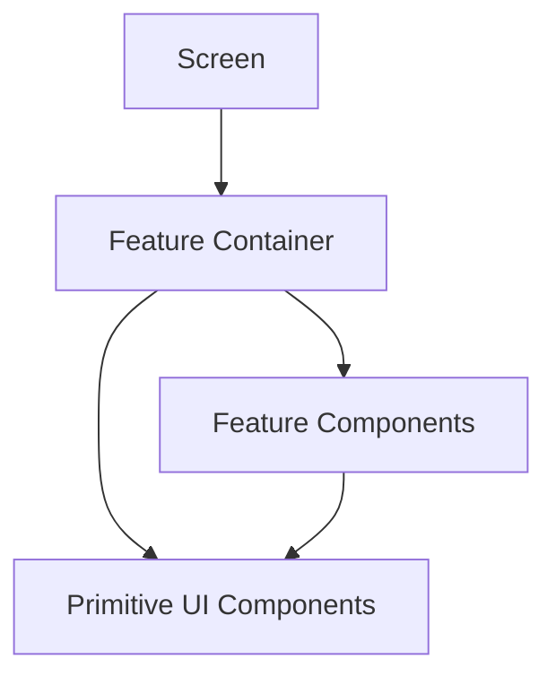

# Components

## Component Philosophy
Components must be reusable, typed, state-aware, and semantically named. The goal is not to build a large UI kit for its own sake, but to establish dependable primitives that keep feature teams fast and consistent.

## Foundational Components

| Component | Purpose | Key Props |
| --- | --- | --- |
| `Screen` | Standard page wrapper with safe-area handling | title, scrollable, padded |
| `AppHeader` | Consistent navigation header | title, subtitle, actions |
| `PrimaryButton` | Primary action trigger | label, loading, disabled, icon |
| `SecondaryButton` | Secondary or low-emphasis action | label, variant |
| `StatusChip` | Small semantic state indicator | intent, label |
| `InfoCard` | Structured content block | title, content, footer |
| `Section` | Vertical grouping of related content | title, children |
| `EmptyState` | Guidance for no-content screens | title, description, action |
| `ErrorState` | Recovery path for failures | title, message, retry |

## Feature Components

| Component | Feature Area | Responsibility |
| --- | --- | --- |
| `ScanModeSwitcher` | Scanner | Toggle between barcode and OCR modes |
| `CameraOverlay` | Scanner | Guide framing and communicate capture state |
| `OCRReviewEditor` | OCR | Allow text validation before analysis |
| `AnalysisSummaryCard` | Results | Show primary decision summary |
| `IngredientRiskList` | Results | List flagged ingredients with rationale |
| `PersonalizationBanner` | Results | Explain how user profile affected output |
| `HistoryListItem` | History | Present prior scan snapshot |
| `PreferenceSelector` | Profile | Capture dietary and allergy preferences |

## Component Boundaries

| Rule | Why It Matters |
| --- | --- |
| Components should not fetch remote data directly unless explicitly container-level | Preserves testability and separation of concerns |
| Presentational components receive typed view models | Reduces coupling to backend shape changes |
| Feature components may compose primitives, not bypass them casually | Maintains consistency |

## State Strategy

| Component Type | State Ownership |
| --- | --- |
| Primitive components | Minimal local state only for UI interaction |
| Feature containers | Own async state and orchestration |
| Shared app state | Stored via Zustand or React Query where appropriate |

## Component Relationship Diagram

## Decision Notes
We should resist creating highly configurable "god components." Focused components with clear names are easier to test, easier to replace, and better aligned with feature-first architecture.
