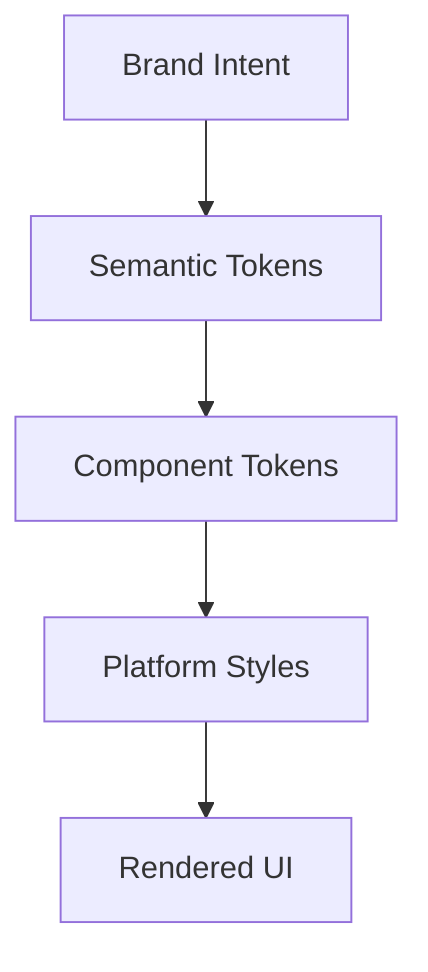

# Design System

## Design References

| Source | Scope | Link |
| --- | --- | --- |
| Figma (AI) | Premium Onboarding Experience | https://www.figma.com/make/LGeS55zJlGOpjoCebPhvhm/Premium-Onboarding-Experience |

## Design Direction
The visual system for Khasahi AI should communicate clarity, intelligence, and calm decisiveness. The product category invites anxiety, so the interface must feel trustworthy rather than overly playful.

## Brand Attributes

| Attribute | Design Expression |
| --- | --- |
| Trustworthy | Strong contrast, clean card structure, restrained color usage |
| Intelligent | Clear hierarchy, precise spacing, structured data presentation |
| Human | Warm accent colors and approachable copy tone |
| Fast | Minimal ornamental friction and immediate feedback |

## Color System

| Token | Purpose | Suggested Role |
| --- | --- | --- |
| `color.bg.primary` | App background | Soft neutral background |
| `color.surface.primary` | Card surface | Elevated content panels |
| `color.text.primary` | Main text | High-contrast reading |
| `color.text.secondary` | Supporting text | Metadata and helper copy |
| `color.intent.safe` | Positive indication | Suitable or no major issues |
| `color.intent.warn` | Caution indication | Moderately concerning content |
| `color.intent.danger` | Critical warning | Allergens or non-compliance |
| `color.accent` | Primary brand action | Buttons and active states |

## Typography

| Role | Usage | Design Rule |
| --- | --- | --- |
| Display | Major screen headers | Limited use, high impact |
| Title | Section headers | Strong contrast and compact line length |
| Body | Explanation content | Optimize for readability over density |
| Label | Chips and form controls | Short, precise, and legible |
| Mono or tabular figures | Nutrition values and metrics | Aligns data clearly |

## Spacing and Layout

| Token | Use |
| --- | --- |
| `space.4` | Tight inline spacing |
| `space.8` | Between related controls |
| `space.12` | Dense card internals |
| `space.16` | Standard block spacing |
| `space.24` | Section separation |
| `space.32` | Major screen rhythm |

## Elevation and Shape

| Element | Recommendation | Reason |
| --- | --- | --- |
| Cards | Medium radius with subtle elevation | Feels modern without visual noise |
| Buttons | Strong shape consistency | Improves recognizability |
| Alert banners | Distinct border or tint treatment | Important states need fast detection |

## Iconography

| Guideline | Reason |
| --- | --- |
| Use icons to reinforce, not replace labels | Nutrition decisions require clarity |
| Reserve warning icons for real concern states | Prevents desensitization |
| Keep icon set stylistically consistent | Avoids fragmented visual language |

## Design Token Architecture

## Accessibility Rules

| Area | Rule |
| --- | --- |
| Contrast | Meet strong readability targets for all essential text |
| Dynamic type | Support enlarged fonts without breaking layouts |
| Motion | Respect reduced motion preference |
| State indication | Never rely on color alone for meaning |

## Decision Notes
The design system should be semantic-token driven from the beginning. This keeps React Native implementation scalable, enables theming later, and prevents hard-coded design drift across features.
