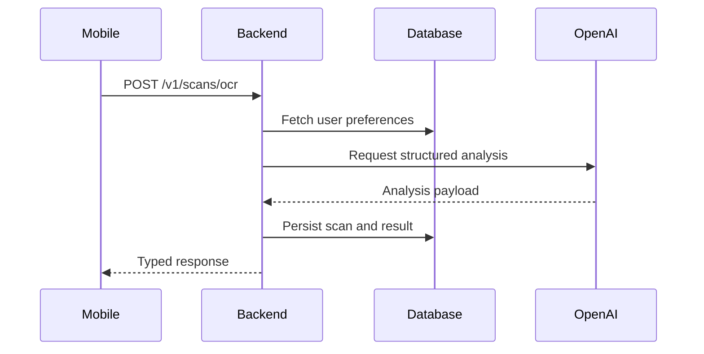

# API Specification

## API Philosophy
The API should be typed, versionable, and explicit about uncertainty. It exists to orchestrate product resolution, personalization, AI analysis, and persistence while keeping the mobile app lightweight.

## Base Design Decisions

| Area | Decision | Why |
| --- | --- | --- |
| Style | REST over HTTPS | Pragmatic for mobile MVP and FastAPI support |
| Versioning | Prefix routes with `/v1` | Allows additive evolution |
| Auth | Supabase JWT validated by backend | Aligns mobile auth and API authorization |
| Response shape | Consistent envelope for errors and metadata | Improves mobile handling |

## Core Endpoints

| Method | Path | Purpose |
| --- | --- | --- |
| `POST` | `/v1/auth/session/validate` | Validate or hydrate session context |
| `GET` | `/v1/profile/me` | Fetch current user profile |
| `PUT` | `/v1/profile/me/preferences` | Upsert dietary preferences |
| `POST` | `/v1/scans/barcode` | Resolve barcode and trigger analysis |
| `POST` | `/v1/scans/ocr` | Submit OCR text and trigger analysis |
| `GET` | `/v1/scans/history` | Retrieve scan history |
| `GET` | `/v1/scans/{scan_id}` | Retrieve a specific scan result |

## Example Request Contracts

### `POST /v1/scans/barcode`

| Field | Type | Required | Notes |
| --- | --- | --- | --- |
| `barcode` | string | Yes | Raw barcode value |
| `client_scan_id` | string | No | Client-generated id for tracing |
| `capture_context` | object | No | Device or capture metadata |

### `POST /v1/scans/ocr`

| Field | Type | Required | Notes |
| --- | --- | --- | --- |
| `ocr_text` | string | Yes | User-reviewed ingredient text |
| `product_name_hint` | string | No | Optional packaging-derived label |
| `client_scan_id` | string | No | Trace id |

## Example Response Contract

| Field | Type | Notes |
| --- | --- | --- |
| `scan_id` | string | Server-generated identifier |
| `product` | object | Canonical product summary |
| `analysis` | object | Structured result with summary and flags |
| `personalization_applied` | object | Which profile rules influenced output |
| `confidence` | object | Data and analysis confidence metadata |

## Error Model

| Code | Meaning | Client Behavior |
| --- | --- | --- |
| `UNAUTHORIZED` | Invalid or missing session | Force re-auth |
| `BARCODE_NOT_FOUND` | No product match from barcode path | Offer OCR fallback |
| `OCR_TEXT_INVALID` | Submitted OCR payload unusable | Return to review flow |
| `ANALYSIS_TIMEOUT` | AI or orchestration exceeded deadline | Show retry option |
| `RATE_LIMITED` | Traffic protection triggered | Ask user to retry shortly |

## API Sequence

## Response Envelope Recommendation

| Field | Purpose |
| --- | --- |
| `data` | Successful payload |
| `error` | Machine-readable error object when applicable |
| `meta` | Trace ids, timestamps, and version info |

## Observability Fields

| Field | Why Capture It |
| --- | --- |
| `trace_id` | Correlate app, backend, and AI events |
| `prompt_version` | Debug AI behavior regressions |
| `model_version` | Evaluate response quality by model |
| `processing_ms` | Track latency targets |

## Assumptions

| Assumption | Impact |
| --- | --- |
| Mobile app is primary consumer | API can optimize response shapes for app UX |
| Structured AI outputs are required | Backend should validate AI schema before responding |

## Decision Notes
The API should return decision-ready results, not raw pipeline fragments. Mobile should not need to reconstruct meaning from multiple backend calls during the critical scan flow.
## Lifestyle Profile Contract

| Field | Type | Notes |
| --- | --- | --- |
| `lifestyle.profile_id` | string | Stable identifier such as `it-professional` |
| `lifestyle.answers` | array | Dynamic list of field answers for the chosen profile |
| `health_goals` | array | Used directly by the AI layer |
| `dietary_preferences` | array | Used for compliance and caution logic |
| `allergies` | array | Used for high-priority safety flags |
| `age` | integer | Optional personalization input |

The API contract is intentionally data-driven: new lifestyle profiles should be added by registry and validation updates, not by redesigning scan endpoints or prompt interfaces.
