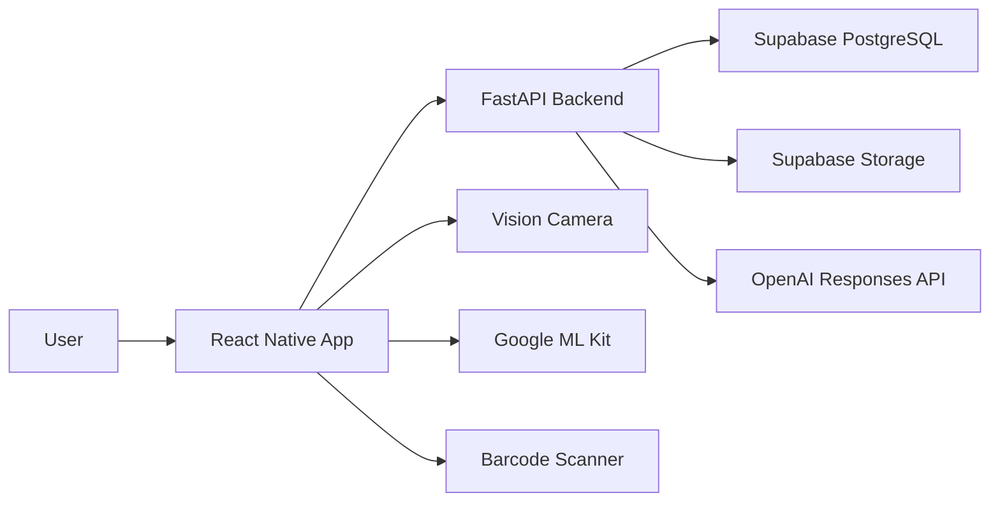
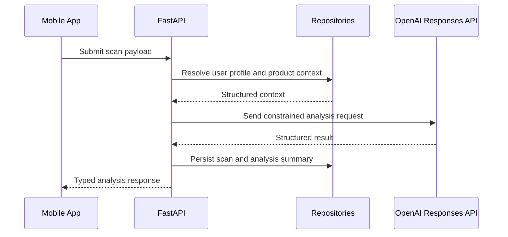
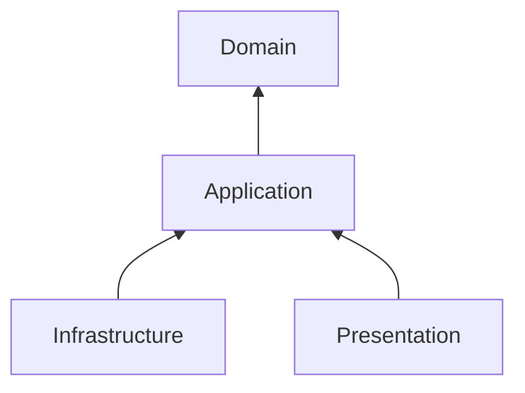

# Architecture

## Executive Summary
Khasahi AI should be built as a mobile-first, API-backed system with cleanly separated domain, data, and presentation boundaries. The architecture must support rapid hackathon execution without painting the team into a corner for post-hackathon production work.

## Architecture Principles

| Principle | Decision | Why |
| --- | --- | --- |
| Clean Architecture | Separate presentation, application, domain, and infrastructure concerns | Reduces coupling and improves testability |
| SOLID | Favor focused interfaces and dependency inversion | Keeps feature growth manageable |
| Feature First | Organize by product capability rather than technical layer alone | Improves ownership and onboarding |
| Dependency Injection | Construct services behind interfaces | Enables mocking and environment flexibility |
| Repository Pattern | Abstract persistence and remote access | Keeps domain logic independent of data source details |
| Type Safety | Typed API contracts and local models | Prevents runtime mismatch across mobile and backend |

## System Context

## Why a Backend Is Required

| Concern | Client-Only Limitation | Backend Decision |
| --- | --- | --- |
| Secret management | OpenAI keys cannot live safely in the app | Route AI calls through FastAPI |
| Prompt governance | Prompt versions need centralized control | Store and version prompts server-side |
| Data normalization | Product and ingredient structures require canonicalization | Normalize before AI analysis |
| Auditability | We need traceability for decisions and failures | Persist request metadata and outcomes |

## Logical Layers

| Layer | Responsibility | Example Elements |
| --- | --- | --- |
| Presentation | UI state, navigation, interactions | Screens, hooks, view models |
| Application | Use cases and orchestration | Scan product, analyze ingredients |
| Domain | Entities, policies, and rules | Product, Ingredient, UserProfile, RiskAssessment |
| Infrastructure | External systems and implementations | Supabase repositories, OpenAI adapter, camera integrations |

## Mobile Architecture

| Area | Decision | Rationale |
| --- | --- | --- |
| Navigation | React Navigation with feature-owned routes | Flexible and familiar for RN CLI apps |
| Local state | Zustand for client state not suited to server caching | Lightweight and predictable |
| Server state | React Query | Caching, retries, and request lifecycle control |
| Secure storage | MMKV for performant local persistence | Fast and suitable for session-adjacent client data |
| Camera pipeline | Vision Camera plus ML Kit | Best-in-class performance for scan-first UX |

## Backend Architecture

| Area | Decision | Rationale |
| --- | --- | --- |
| Framework | FastAPI | Strong typing, async support, OpenAPI generation |
| Validation | Pydantic models | Enforces contract integrity |
| AI gateway | Dedicated analysis service layer | Centralizes prompting and response parsing |
| Persistence | Supabase PostgreSQL via repository layer | Managed Postgres with auth alignment |
| File handling | Supabase Storage for uploads when needed | Keeps binary storage outside relational tables |

## Request Lifecycle

## Dependency Direction

The diagram represents code-level dependency inversion: infrastructure implements interfaces defined closer to the domain or application layers, not the other way around.

## Architectural Decisions

| Decision | Chosen Approach | Explanation |
| --- | --- | --- |
| AI call location | Backend only | Protect secrets and preserve prompt governance |
| OCR execution | On-device with ML Kit | Faster feedback and lower server cost |
| Barcode execution | On-device camera pipeline | Real-time UX requires native-speed processing |
| Personalization logic | Hybrid rules plus AI explanation | Deterministic safety flags with flexible summaries |
| History storage | Server-backed with local cache | Users expect continuity across sessions and devices |

## Scalability Strategy

| Concern | Current Design | Future Path |
| --- | --- | --- |
| Traffic growth | Stateless API services | Horizontal scaling behind load balancer |
| AI cost | Structured prompts and concise outputs | Caching and tiered analysis depth |
| Data growth | Normalized relational schema | Partition high-volume event tables if needed |
| Feature growth | Feature-first mobile modules | Add independent features without cross-cutting sprawl |

## Assumptions

| Assumption | Impact |
| --- | --- |
| Hackathon scope favors a single mobile client | Backend APIs can remain mobile-optimized initially |
| Team can maintain one backend service during MVP | Avoid unnecessary microservices |
| AI responses must be reviewable and structured | Prefer schema-constrained outputs over long prose |

## Recommended ADR Practice
Any major change to prompt strategy, data model, or scan pipeline should be recorded as an Architecture Decision Record after hackathon kickoff to prevent drift.
