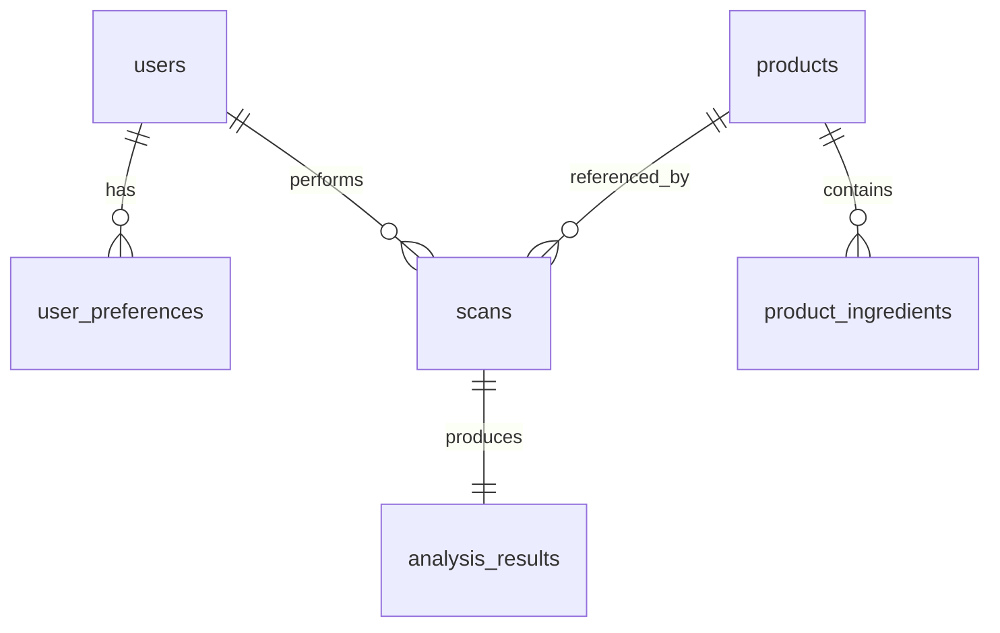

# Database Design

## Database Strategy
Supabase PostgreSQL is the system of record for users, preferences, scan history, analysis outputs, and product metadata captured by the platform. The schema should optimize for traceability and personalization while keeping personally sensitive data intentionally minimal.

## Core Entities

| Entity | Purpose |
| --- | --- |
| `users` | Application-level user profile metadata linked to Supabase Auth |
| `user_preferences` | Dietary restrictions, exclusions, and goals |
| `products` | Normalized product records identified by barcode where available |
| `product_ingredients` | Structured ingredient rows tied to products |
| `scans` | Each scan event initiated by a user |
| `analysis_results` | Stored AI and rule-based analysis outcomes |

## Entity Relationship Diagram

## Proposed Tables

### `users`

| Column | Type | Notes |
| --- | --- | --- |
| `id` | uuid | Matches auth user id |
| `display_name` | text | Optional profile field |
| `created_at` | timestamptz | Audit timestamp |
| `updated_at` | timestamptz | Audit timestamp |

### `user_preferences`

| Column | Type | Notes |
| --- | --- | --- |
| `id` | uuid | Primary key |
| `user_id` | uuid | Foreign key to users |
| `allergies` | jsonb | Structured array of allergens |
| `dietary_preferences` | jsonb | Vegetarian, vegan, etc. |
| `religious_preferences` | jsonb | Cultural or religious restrictions |
| `health_goals` | jsonb | Protein focus, low sugar, and similar goals |
| `updated_at` | timestamptz | Profile freshness |

### `products`

| Column | Type | Notes |
| --- | --- | --- |
| `id` | uuid | Primary key |
| `barcode` | text | Nullable because OCR-only products may not have one |
| `name` | text | Canonical display name |
| `brand` | text | Optional brand field |
| `raw_nutrition` | jsonb | Original nutrition payload if available |
| `source` | text | Barcode source or OCR-derived |
| `created_at` | timestamptz | Audit timestamp |

### `product_ingredients`

| Column | Type | Notes |
| --- | --- | --- |
| `id` | uuid | Primary key |
| `product_id` | uuid | Foreign key to products |
| `ingredient_name` | text | Canonicalized ingredient |
| `ingredient_order` | integer | Preserve label order |
| `raw_text` | text | Original extracted string |
| `normalized_metadata` | jsonb | Optional classifications |

### `scans`

| Column | Type | Notes |
| --- | --- | --- |
| `id` | uuid | Primary key |
| `user_id` | uuid | Foreign key to users |
| `product_id` | uuid | Nullable until product resolution completes |
| `scan_type` | text | Barcode or OCR |
| `source_image_path` | text | Optional storage reference |
| `ocr_text` | text | Captured text when relevant |
| `status` | text | Processing, completed, failed |
| `created_at` | timestamptz | Event time |

### `analysis_results`

| Column | Type | Notes |
| --- | --- | --- |
| `id` | uuid | Primary key |
| `scan_id` | uuid | Unique foreign key to scans |
| `summary` | text | Human-readable top result |
| `risk_level` | text | Safe, caution, avoid, unknown |
| `structured_flags` | jsonb | Deterministic warnings and classifications |
| `ai_explanation` | jsonb | Structured OpenAI response |
| `model_version` | text | For observability and replay |
| `prompt_version` | text | For governance |
| `created_at` | timestamptz | Audit timestamp |

## Indexing Strategy

| Table | Index | Reason |
| --- | --- | --- |
| `products` | Unique index on `barcode` where not null | Fast product lookup |
| `scans` | Index on `user_id, created_at desc` | Efficient history queries |
| `analysis_results` | Index on `risk_level` if analytics require it | Reporting and filtering |
| `product_ingredients` | Index on `product_id, ingredient_order` | Ordered ingredient retrieval |

## Row-Level Security

| Table | RLS Policy Direction |
| --- | --- |
| `users` | User can read and update own profile |
| `user_preferences` | User can manage own preferences only |
| `scans` | User can read own scans only |
| `analysis_results` | User can read results tied to own scans |
| `products` | Service role writes; read policy may be broader depending on caching strategy |

## Data Lifecycle

| Data Type | Retention Approach |
| --- | --- |
| Profile and preferences | Long-lived until user deletion |
| Scan history | Retained for user utility with delete support |
| Source images | Store only if needed for retries or audit, otherwise avoid by default |
| Prompt and model metadata | Retained for debugging and evaluation |

## Architectural Decisions

| Decision | Explanation |
| --- | --- |
| Use JSONB for preferences and structured AI flags | Flexible enough for evolving schemas without constant migrations |
| Separate `scans` and `analysis_results` | Distinguishes event capture from outcome generation |
| Keep ingredient rows normalized | Supports future search, analytics, and rule engines |

## Assumptions

| Assumption | Consequence |
| --- | --- |
| OCR source images are not always necessary long term | Default posture should minimize stored image data |
| Product catalog quality will evolve | Schema must support partial records and re-analysis |
