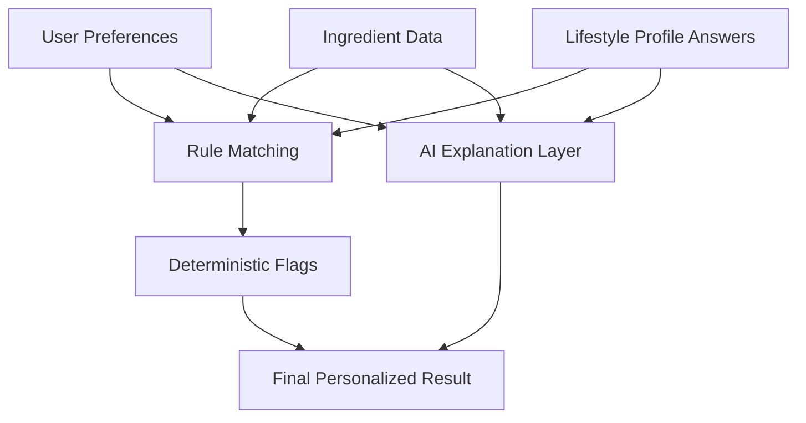

# AI Personalization

## Personalization Goal
Personalization should make output feel specifically useful without making the system opaque. Khasahi AI must explain how and why user profile data influenced the result.

## Personalization Dimensions

| Dimension | Example Use |
| --- | --- |
| Lifestyle profile | Tailor reasoning to work routine, household role, or life stage |
| Allergies and intolerances | Flag ingredients that may trigger adverse reactions |
| Dietary preferences | Identify conflicts with vegetarian or vegan choices |
| Religious preferences | Surface ingredients that may be non-compliant |
| Health goals | Emphasize sugar, additives, protein, or processing concerns |
| Explanation level | Adjust wording complexity over time if product supports it |

## Lifestyle Profile Engine

| Design Requirement | Decision |
| --- | --- |
| Profiles must influence AI recommendations | Every AI request includes a structured lifestyle object |
| Profiles must be extensible | Profiles are modeled as data with dynamic follow-up fields |
| IT Professional is a flagship profile | Onboarding captures work style, sitting hours, and schedule |
| New profiles must not require AI engine rewrites | Prompt builder consumes a generic `profile_id + answers[]` shape |

### IT Professional Example Context

| Field | Example Value |
| --- | --- |
| `profile_id` | `it-professional` |
| `work-style` | `remote` |
| `daily-sitting-hours` | `over-8` |
| `work-schedule` | `day-shift` |
| `health_goal` | `Improve Liver Health` |

The AI should use these details to explain why a product may or may not align with the user's goals, but it must still ground the recommendation in nutrition facts and ingredients rather than the persona label alone.

## Personalization Model

## Why Hybrid Personalization

| Approach | Limitation |
| --- | --- |
| Rules only | Safe but too rigid and not very explanatory |
| AI only | Flexible but too risky for safety-critical interpretation |

The recommended architecture is hybrid: deterministic rules drive safety and compliance flags, while AI generates user-friendly explanation around those facts.

## Personalization Decision Table

| Input | System Behavior |
| --- | --- |
| IT Professional with liver-health goal | Emphasize sugar, saturated fat, and regular-consumption caution when supported by evidence |
| Allergy match found | Elevate to high-priority warning |
| Vegan preference with ambiguous additive | Mark as caution with explanation |
| High-protein goal | Mention protein context but do not override safety issues |
| Missing profile data | Return general analysis and prompt user to refine profile |

## Data Minimization

| Principle | Implementation |
| --- | --- |
| Collect only what affects decisions | Limit profile to preference-relevant fields |
| Avoid unnecessary sensitive inference | Do not derive health conditions beyond explicit user input |
| Explain personalization | Show the matched preference categories in results |

## Personalization Feedback Loop

| Signal | Future Use |
| --- | --- |
| User edits OCR before analysis | Improve prompt handling of noisy text |
| Repeated profile changes | Reveal confusing profile options |
| Result revisit patterns | Identify which explanations users value most |

## Assumptions

| Assumption | Impact |
| --- | --- |
| Users will trust personalization only if it is visible | UI must surface matched preferences |
| Different users want different levels of detail | Architecture should support configurable explanation depth later |

## Decision Notes
Personalization should never silently change safety posture. If the system elevates or downgrades concern due to user preferences, that decision must be visible in the returned structure and UI.
