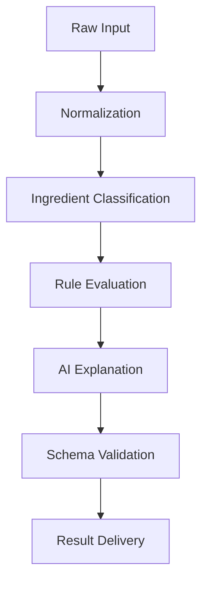

# Ingredient Analysis

## Goal
Ingredient analysis is the core intelligence layer of Khasahi AI. It transforms raw ingredient text or product data into a user-relevant explanation that is accurate, understandable, and operationally safe.

## Analysis Inputs

| Input Type | Source | Notes |
| --- | --- | --- |
| Barcode product data | Barcode pipeline and normalized product repository | Best case for structured context |
| OCR ingredient text | Google ML Kit plus user correction | Higher uncertainty path |
| User profile | Supabase-stored preferences | Personalization context |
| Rule set | Internal policy definitions | Safety, dietary, and wording constraints |

## Analysis Stages

## Stage Breakdown

| Stage | Purpose | Key Decision |
| --- | --- | --- |
| Normalization | Clean, dedupe, and order ingredient data | Preserve original text for audit |
| Classification | Tag ingredients by type or concern | Support future rules and analytics |
| Rule evaluation | Apply deterministic safety and compliance checks | Treat hard matches as authoritative |
| AI explanation | Convert evidence into plain-language guidance | Keep explanation constrained |
| Validation | Ensure payload shape and safe wording | Reject malformed outputs before returning |

## Analysis Output Model

| Field | Description |
| --- | --- |
| `overall_assessment` | Top-level result for quick decision making |
| `matched_concerns` | Allergen, ethical, religious, or goal-related flags |
| `ingredient_notes` | Ingredient-by-ingredient relevant explanation |
| `uncertainty_notes` | Gaps caused by source quality or ambiguity |
| `recommended_action` | Optional next step such as avoid, review, or acceptable |

## Confidence Strategy

| Signal | Interpretation |
| --- | --- |
| Barcode product with normalized ingredients | High-confidence source context |
| OCR text with user review | Medium confidence |
| OCR text with low confidence and no review | Low confidence and stronger caveats |
| Ambiguous ingredient alias | Caution, not certainty |

## Rule Versus AI Responsibility

| Concern | Owned By |
| --- | --- |
| Exact allergy matches | Deterministic rule engine |
| Dietary compliance checks with known ingredient mappings | Deterministic rule engine |
| Plain-language explanation of technical ingredients | AI layer |
| Summary tone and readability | AI layer under policy constraints |

## Failure Modes

| Failure Mode | Mitigation |
| --- | --- |
| OCR misses ingredient segments | Offer review screen and confidence note |
| Product data is incomplete | Mark unknowns and avoid overclaiming |
| AI output drifts from evidence | Validate against schema and bounded prompt |
| Ingredient aliases are ambiguous | Maintain alias dictionary and conservative wording |

## Assumptions

| Assumption | Consequence |
| --- | --- |
| Users care most about safety and clarity | Result ordering must prioritize warnings |
| Ingredient intelligence will improve over time | Keep classification and rules extensible |

## Decision Notes
Ingredient analysis should be treated as a governed pipeline, not a single model call. Most trust failures in this product category come from poor normalization or weak guardrails, not from lack of model capability.
