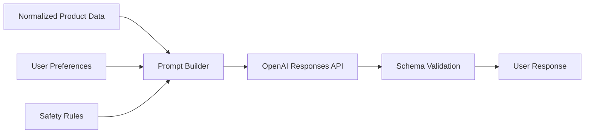

# Prompt Engineering

## Objective
Prompt engineering for Khasahi AI must produce structured, evidence-based ingredient explanations that are personalized without becoming speculative. The system should behave less like a creative assistant and more like a constrained nutrition interpretation engine.

## Prompt Design Principles

| Principle | Implementation |
| --- | --- |
| Evidence first | Only reason from supplied product, ingredient, and user context |
| Structured output | Require schema-constrained response sections |
| Conservative language | Mark uncertainty instead of guessing |
| Personal relevance | Apply profile data only when clearly connected |
| Repeatability | Version prompts and minimize unnecessary variation |

## Prompt Input Schema

| Input Block | Contents |
| --- | --- |
| Product context | Name, brand, barcode, nutrition data if available |
| Ingredient context | Ordered ingredients, normalized classifications, raw text |
| User context | Lifestyle profile id, lifestyle answers, allergies, diet, religious preferences, health goals, optional age |
| Policy context | Safety rules, wording constraints, prohibited claims |

## Data-Driven Lifestyle Prompting

| Requirement | Prompt Strategy |
| --- | --- |
| Support IT Professional now | Include profile id and structured answers in prompt input |
| Support future profiles later | Prompt builder renders any `answers[]` entries generically |
| Avoid hardcoded persona logic in prompts | Use field labels and values supplied by the lifestyle registry |
| Keep outputs specific | Require model to reference matched lifestyle and goal signals explicitly |

## Output Schema

| Field | Purpose |
| --- | --- |
| `summary` | Fast user-facing recommendation |
| `risk_level` | Safe, caution, avoid, unknown |
| `flags` | Structured concerns and matched user rules |
| `ingredient_explanations` | Plain-language breakdown of relevant ingredients |
| `confidence_notes` | Explain ambiguity or data quality limits |

## Prompt Pipeline

## Prompt Layers

| Layer | Purpose |
| --- | --- |
| System instruction | Define role, constraints, and tone |
| Developer policy block | Enforce schema, safety, and refusal boundaries |
| User payload | Inject product and preference data |
| Evaluation metadata | Track prompt version and experimental variant |

## Guardrails

| Risk | Guardrail |
| --- | --- |
| Unsupported medical claims | Explicitly prohibit diagnosis or treatment language |
| Hallucinated ingredients | Require all claims to map to supplied data |
| Overstated certainty | Add confidence notes when source quality is weak |
| Preference confusion | Separate deterministic rule matches from interpretive commentary |

## Example Reasoning Policy

| Rule | Reason |
| --- | --- |
| If allergen match is explicit, elevate warning regardless of overall sentiment | Safety must outrank narrative summary |
| If an ingredient is ambiguous, say it may be a concern and explain why | Better to be honest than falsely precise |
| If profile is incomplete, say personalization is limited | Prevent false impression of deep tailoring |

## Evaluation Strategy

| Evaluation Type | Goal |
| --- | --- |
| Golden set regression | Ensure stable outputs on known products |
| Persona-based review | Confirm relevance for different user profiles |
| Adversarial testing | Detect speculation and overclaiming |
| Latency review | Keep prompts concise enough for fast responses |

## Assumptions

| Assumption | Consequence |
| --- | --- |
| Users prefer clarity over exhaustiveness | Prompts should bias toward concise summaries |
| Safety credibility is more important than sounding smart | Conservative phrasing is a product requirement |

## Decision Notes
Prompt engineering is a product surface, not a hidden implementation detail. Prompt versions should be treated like release artifacts with change review and evaluation.
