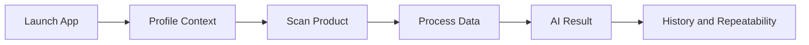

# Demo Script

## Demo Objective
Present Khasahi AI as a polished, production-minded mobile product that uses AI responsibly to make food decisions faster, safer, and more personalized.

## Demo Narrative

| Segment | Message |
| --- | --- |
| Problem | Ingredient labels are hard to interpret quickly |
| Solution | Khasahi AI turns a scan into personalized understanding |
| Differentiator | Personalized, explainable, and architecture-ready for production |
| Credibility | Strong stack choices, backend governance, and user-centered UX |

## Live Demo Flow

| Step | Action | Talking Point |
| --- | --- | --- |
| 1 | Open app | Start with the product promise, not the tech stack |
| 2 | Show profile preferences | Explain that personalization changes outcomes responsibly |
| 3 | Scan a packaged product | Highlight real-time barcode or OCR workflow |
| 4 | Wait through analysis state | Mention stage-aware progress and backend orchestration |
| 5 | Show result screen | Emphasize summary, warnings, and ingredient explanations |
| 6 | Open history | Demonstrate continuity and product maturity |

## Demo Sequence

## Suggested Spoken Script

| Moment | Suggested Framing |
| --- | --- |
| Opening | Khasahi AI helps people understand what they are really buying in seconds |
| During scan | We combine native camera performance, OCR, and AI interpretation in one mobile workflow |
| On results | The output is not a black box score; it is personalized, evidence-based guidance |
| On architecture | We built this with a backend governance layer so prompts, policies, and data quality can scale safely |

## Judge-Focused Technical Highlights

| Topic | Point to Emphasize |
| --- | --- |
| React Native architecture | CLI-based, production-oriented, typed, and modular |
| AI safety | Structured Responses API usage with backend-controlled prompts |
| Personalization | Hybrid rules and AI explanation |
| Reliability | FastAPI contracts, Supabase persistence, and recoverable scan flows |

## Demo Risks and Fallbacks

| Risk | Fallback |
| --- | --- |
| Live OCR quality degrades | Use a well-lit backup product or barcode path |
| Network latency spikes | Show cached history and discuss processing pipeline |
| AI response delay | Narrate stage-aware UX and switch to prepared completed flow if necessary |

## Final Close

| Message | Why It Lands |
| --- | --- |
| Khasahi AI is not just a scanner, it is a trusted decision layer for everyday food choices | Reinforces product depth |
| We designed the stack and architecture to survive beyond the hackathon | Signals seriousness and execution quality |

## Decision Notes
The best demo is short, controlled, and trust-focused. We should show one compelling journey exceptionally well rather than attempt feature overload.
