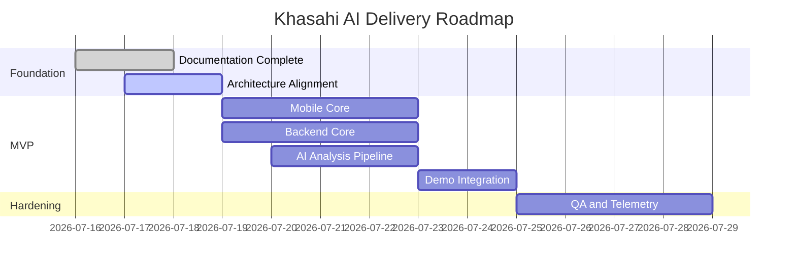

# Roadmap

## Release Strategy
The roadmap is structured around proving the core loop first, then improving trust, retention, and scale. For the hackathon, shipping a stable vertical slice is more valuable than broad but shallow functionality.

## Phase Plan

| Phase | Goal | Time Horizon |
| --- | --- | --- |
| Phase 0 | Documentation and architecture alignment | Immediate |
| Phase 1 | Hackathon MVP vertical slice | Demo deadline |
| Phase 2 | Beta hardening | First post-demo sprint |
| Phase 3 | Growth and intelligence expansion | After product validation |

## Phase 1: Hackathon MVP

| Workstream | Deliverable |
| --- | --- |
| Mobile foundations | Auth, navigation, scanner shell, profile setup |
| Backend foundations | FastAPI service, auth verification, scan endpoints |
| AI workflow | Prompted ingredient analysis with structured response |
| Data layer | Core schema and scan persistence |
| Demo readiness | Reliable happy path with clear fallback states |

## Phase 2: Beta Hardening

| Area | Investment |
| --- | --- |
| Observability | Trace IDs, error dashboards, latency metrics |
| Quality | Golden set evaluation for AI outputs and mobile regression tests |
| Data quality | Better ingredient normalization and barcode coverage |
| UX polish | Smarter loading, caching, and result confidence treatment |

## Phase 3: Growth

| Area | Opportunity |
| --- | --- |
| Recommendation engine | Safer alternatives and substitute suggestions |
| Catalog intelligence | Product comparisons and brand-level insights |
| Internationalization | Multi-region ingredient vocabularies |
| Retention | Notifications, saved lists, and repeat purchase workflows |

## Milestone Diagram

## Prioritization Rules

| Rule | Meaning |
| --- | --- |
| Protect the demo loop | Anything that improves scan-to-result reliability outranks nice-to-have features |
| Trust beats novelty | Explainability and confidence handling outrank flashy extras |
| Build forward | MVP shortcuts are acceptable only if they do not create rewrite-level debt |

## Risks to Roadmap

| Risk | Effect | Mitigation |
| --- | --- | --- |
| OCR tuning takes longer than expected | Delays confidence in analysis path | Keep barcode path strong for demo |
| API and mobile integration churn | Slows team velocity | Lock typed contracts early |
| AI output inconsistency | Threatens trust narrative | Use prompt versioning and golden-set validation |

## Decision Notes
The roadmap assumes disciplined scope management. If deadlines tighten, reduce breadth before reducing reliability.
